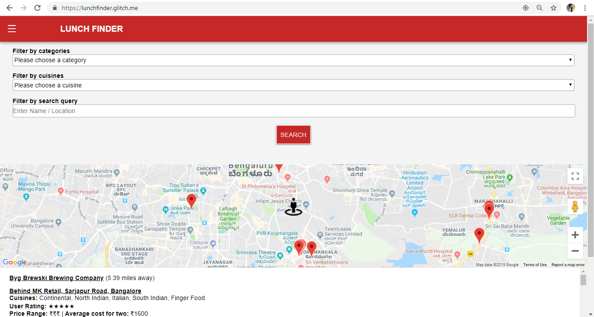
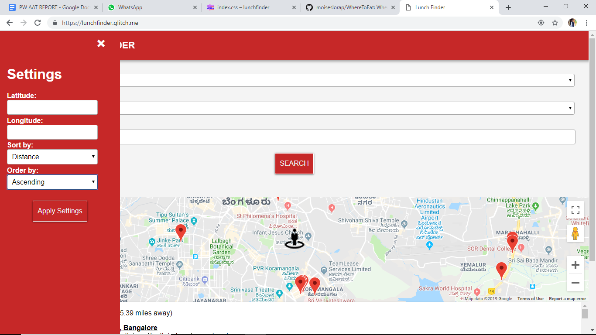

# Lunchfinder

A Fully functional dynamic web page designed for finding the best restaurant options taking into account location, price and type of cuisine required by the customer. 

## Features

- Consumes data from an API listing more than 1.5 million restaurants across 10,000 cities globally.
- Uses the Google Maps API to display markers for the nearby restaurants.

## Technologies Used: 

- Zomato API 
- Google Maps API   
-	HTML5 
- CSS3 
- JavaScript 	

## Screenshots

| Home Page | 
| -------|
|  |

| Navbar with Features |
| ---------------|
|  |

#### Live Demo: https://lunchfinder.glitch.me 

( Maps for development purposes only. API key not activated )
